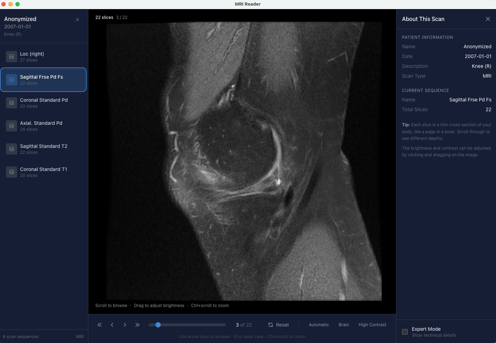

# MRI Reader

A cross-platform desktop application for viewing personal MRI and DICOM medical imaging files.

## About

MRI Reader lets you view your medical scan data privately on your computer. Inspired by [Tobi Lutke's MRI viewer](https://startupnews.fyi/2026/01/12/ai-did-it-in-one-prompt-shopify-ceo-tobi-lutke-builds-his-own-mri-viewer/), this app was built because medical imaging facilities often provide DICOM files that require specialized software to view.

**Key Features:**

- **Private & Offline** - All data stays on your computer. No internet required.
- **Easy to Use** - Designed for people without medical imaging experience
- **Cross-Platform** - Works on macOS, Windows, and Linux
- **Open Source** - MIT licensed, free to use and modify



## Installation

### macOS

**Download:** Get the latest `.dmg` file from the [Releases page](https://github.com/tbz43353/mri-reader/releases)

1. Download `MRI.Reader-1.0.0.dmg` (Intel) or `MRI.Reader-1.0.0-arm64.dmg` (Apple Silicon)
2. Open the downloaded DMG file
3. Drag **MRI Reader** to your **Applications** folder
4. Open MRI Reader from your Applications folder

**Troubleshooting:**

If macOS blocks the app:
1. Go to **System Settings** → **Privacy & Security**
2. Scroll down and click **"Open Anyway"**

### Windows & Linux

Coming soon. For now, you can [build from source](#building-from-source).

## Usage

### Opening Your Scans

1. **From a Folder** - Click "Open Folder" and select the folder containing your DICOM files
2. **From a ZIP** - Click "Open ZIP Archive" and select the ZIP file from your imaging facility

The app automatically finds and organizes all your scan images.

### Viewing Images

- **Browse Slices** - Use your scroll wheel or the slider at the bottom
- **Adjust Brightness** - Click and drag on the image
- **Zoom** - Ctrl + scroll wheel
- **Pan** - Right-click and drag (or middle-click and drag)
- **Reset View** - Press R or click the Reset button

### Keyboard Shortcuts

| Action | Shortcut |
|--------|----------|
| Open Folder | ⌘O (Mac) / Ctrl+O (Windows) |
| Open ZIP | ⇧⌘O (Mac) / Ctrl+Shift+O (Windows) |
| Previous Slice | ↑ or ← |
| Next Slice | ↓ or → |
| First Slice | Home |
| Last Slice | End |
| Reset View | R |
| Close Study | Escape |

## Medical Disclaimer

**This software is NOT a medical device and is NOT intended for diagnostic purposes.**

MRI Reader is a personal viewing tool only. It is not FDA-cleared, CE-marked, or approved by any regulatory body for clinical or diagnostic use. Do not use this software to make medical decisions. Always consult qualified healthcare professionals for interpretation of medical images.

The authors and contributors are not liable for any decisions made based on images viewed with this software.

## Privacy

**Your data never leaves your computer.**

- No internet connection required
- No analytics or tracking
- No cloud sync
- All processing happens locally

## Building from Source

### Prerequisites

- [Node.js](https://nodejs.org/) (v18 or later)
- npm (comes with Node.js)
- Git

### Build Steps

1. Clone the repository:
```bash
git clone https://github.com/tbz43353/mri-reader.git
cd mri-reader
```

2. Install dependencies:
```bash
npm install
```

3. Run in development mode:
```bash
npm run electron:dev
```

4. Build installers:
```bash
# macOS
npm run electron:pack:mac

# Windows
npm run electron:pack:win

# Linux
npm run electron:pack:linux
```

Installers will be created in the `release/` directory.

## Technology Stack

- **Electron** - Cross-platform desktop framework
- **React** - UI framework
- **TypeScript** - Type-safe JavaScript
- **Vite** - Build tool
- **Tailwind CSS** - Styling
- **Cornerstone3D** - DICOM image rendering
- **fflate** - ZIP extraction

## Contributing

Contributions are welcome! Please open an issue first to discuss what you'd like to change.

## Support This Project

If you find MRI Reader useful, please consider supporting its development:

- ⭐ **Star this repo** - It helps others discover the project
- 💖 **[GitHub Sponsors](https://github.com/sponsors/tbz43353)** - Monthly or one-time sponsorship
- ☕ **[Ko-fi](https://ko-fi.com/tonybiz)** - Buy me a coffee

Your support helps me dedicate more time to adding features, fixing bugs, and maintaining this project. Thank you!

## License

MIT License - see [LICENSE](LICENSE) for details.

## Author

Created by **Tony Biz**

## Acknowledgments

- Inspired by [Tobi Lutke's MRI viewer post](https://startupnews.fyi/2026/01/12/ai-did-it-in-one-prompt-shopify-ceo-tobi-lutke-builds-his-own-mri-viewer/)
- Built with [Cornerstone3D](https://www.cornerstonejs.org/)
- Sample data structure based on [Prenuvo](https://prenuvo.com/) exports

---

**Questions or Issues?** Open an issue on [GitHub](https://github.com/tbz43353/mri-reader/issues)
